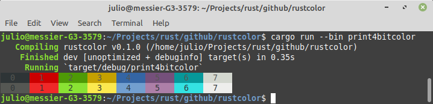

 # Rust Color
Rust Color is a terminal color rendering library,
thats supports 3/4 bit colors, 8 bit colors, 24 bit color
rendering output, compatible with windows.

Rust Color uses **ansi scaped sequences**. This [article](https://en.wikipedia.org/wiki/ANSI_escape_code) in
wikipedia explain how it works.

* How to install - Add the rustcolor crate to your Cargo.toml 
```
[dependencies]
rustcolor = {path = "../rustcolor"}
```
## How to use
* **Styles** - The best way to start with rustcolor is using the predefined styles.
```rust
println!("{}", "this is the info style".to_owned().info());
println!("{}", "this is the primary style".to_owned().primary());
println!("{}", "this is the warn style".to_owned().warn());
println!("{}", "this is the danger style".to_owned().danger());
println!("{}", "this is the error style".to_owned().error());
```


* Printing 4bit color - If you only need to change foreground and background colors, it's possible change a text using print_c16 function.
```rust
fn print_4bit_color() {
    for i in 0..8 {
        let color_data = format!("  {:<4}", i);
        print!("{}", color_data.print_c16(90, i + 40));
    }

    println!();

    for i in 0..8 {
        let color_data = format!("  {:<4}", i);
        print!("{}", color_data.print_c16(30, i + 100));
    }
}
```


* **Printing 8bit color** - Its possible to print 8bit colors using print_c256 function.
```rust
for i in 0..256 {
    let color_data = format!("  {:<4}", i);
    if i % 16 == 0 {
        println!();
    }
    print!("{}", color_data.print_c256(90, i));
}
```


* **Custom Styles** - The style module makes possible to build custom styles.
```rust
let custom_style = StyleBuilder::new()
    .special()
    .foreground_8bit()
    .separator()
    .color(0)
    .separator()
    .backgound_8bit()
    .separator()
    .color(201)
    .end_style()
    .message("a custom style with 0fg and 201bg")
    .special()
    .reset()
    .end_style()
    .build();

println!("{}", custom_style);
```
