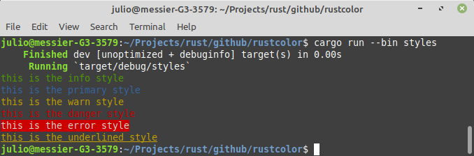
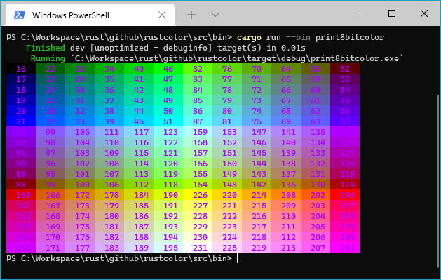
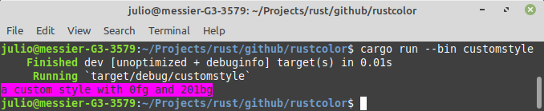

 # Rust Color
Rust Color is a terminal color rendering library,
thats supports 3/4 bit colors, 8 bit colors, 24 bit color
rendering output, compatible with windows.

## ANSI Escape Codes for Terminal Graphics
The ANSI escape code standard, formally adopted as ISO/IEC 6429, defines a series of control sequences.
Each control sequence begins with a **Control Sequence Introducer** (CSI), defined as a scape character
followed immediately by a bracket: **ESC[**. In particular, a CSI followed by a certain number of "parameter bytes"
(ASCII 0-9:; <=>?) then the letter m forms a control sequence known as **Select Graphic Rendition** (SGR). If no
parameter bytes are explicitly given, then it is assumed to be 0. SGR parameters can be chained together with a semicolon **;**
as **delimiter**.

Some common SGR parameters are shown below.

|Parameter | Effect|
|- | -|
|0 | reset all SGR effects to their default|
|1 | bold or increased intensity|
|2 | faint or decreased insensity|
|4 | singly underlined|
|5 | slow blink|
|30-37 | foreground color (3/4 bit)|
|38;5;x | foreground color (256 colors, non-standard)|
|38;2;r;g;b | foreground color (RGB, non-standard)|
|40-47 | background color (8 colors)|
|48;5;x | background color (256 colors, non-standard)|
|48;2;r;g;b | background color (RGB, non-standard)|
|90-97 | bright foreground color (non-standard)|
|100-107 | bright background color (non-standard)|


* Below example will print a red underlined text.


* How to install - Add the rustcolor crate to your Cargo.toml 


```
[dependencies]
rustcolor = {git = "https://github.com/jcbritobr/rustcolor"}
```
## How to use
* **Styles** - The best way to start with rustcolor is using the predefined styles.
```rust
info!("this is the info style");
primary!("this is the primary style");
warn!("this is the warn style");
danger!("this is the danger style");
error!("this is the error style");
underline!("this is the underlined style");
blink!("this is the blink style");
```


* Printing 4bit color - If you only need to change foreground and background colors, it's possible change a text using print_c16 function.
```rust
fn print_4bit_color() {
    for i in 0..8 {
        let color_data = format!("  {:<4}", i);
        print!("{}", color_data.print_c16(90, i + 40));
    }

    println!();

    for i in 0..8 {
        let color_data = format!("  {:<4}", i);
        print!("{}", color_data.print_c16(30, i + 100));
    }

    println!();
}
```


* **Printing 8bit color** - Its possible to print 8bit colors using print_c256 function.
```rust
macro_rules! print_color_pallette {
    ($background:expr, $offset:expr, $op:tt) => {
        for i in (C8_000..C8_006) {
            ...
            println!(
                        "{}{}{}{}{}{}{}{}{}{}{}{}",
                        color_data_0.print_c256($background, $offset.0 $op i),
                        ...
            )
        }
    }
}
fn main() {
    let cold_a = Offset(16, 22, 28, 34, 40, 46, 82, 76, 70, 64, 58, 52);
    let cold_b = Offset(93, 99, 105, 111, 117, 123, 159, 153, 147, 141, 135, 129);
    let warm_a = Offset(160, 166, 172, 178, 184, 190, 226, 220, 214, 208, 202, 196);
    print_color_pallette!(C8_129, cold_a, +);
    print_color_pallette!(C8_129, cold_b, -);
    print_color_pallette!(C8_129, warm_a, +);
}
```


* **Custom Styles** - The style module makes possible to build custom styles.
```rust
fn main() {
    let custom_style = StyleBuilder::new()
        .csi()
        .foreground_8bit()
        .delimiter()
        .color(0)
        .delimiter()
        .background_8bit()
        .delimiter()
        .color(201)
        .end_sgr()
        .message()
        .csi()
        .reset()
        .end_sgr()
        .build();
    
    println!("{}", custom_style.render(" a custom style with 0fg and 201bg "));
}
```




* **24 Bit Color Support** - Draw 24 bit color using print_24bit function.
```rust
fn main() {
    let step = 12;
    println!("***RGB***");
    for i in (0..=255).step_by(step) {
        print!("{}", " ".print_24bit(RGB(0, 0, 0), RGB(i, 0, 0)));
    }
    println!();
    for i in (0..=255).step_by(step) {
        print!("{}", " ".print_24bit(RGB(0, 0, 0), RGB(0, i, 0)));
    }
    println!();
    for i in (0..=255).step_by(step) {
        print!("{}", " ".print_24bit(RGB(0, 0, 0), RGB(0, 0, i)));
    }
    println!("\n***CMY***");
    for i in (0..=255).step_by(step) {
        print!("{}", " ".print_24bit(RGB(0, 0, 0), RGB(255-i, 255-0, 255-0)));
    }
    println!();
    for i in (0..=255).step_by(step) {
        print!("{}", " ".print_24bit(RGB(0, 0, 0), RGB(255-0, 255-i, 255-0)));
    }
    println!();
    for i in (0..=255).step_by(step) {
        print!("{}", " ".print_24bit(RGB(0, 0, 0), RGB(255-0, 255-0, 255-i)));
    }
    println!();
}
```


* 3/4, 8 bit colors cheat sheet - [Click here to download](thumbs/xterm_256color_chart.svg)
